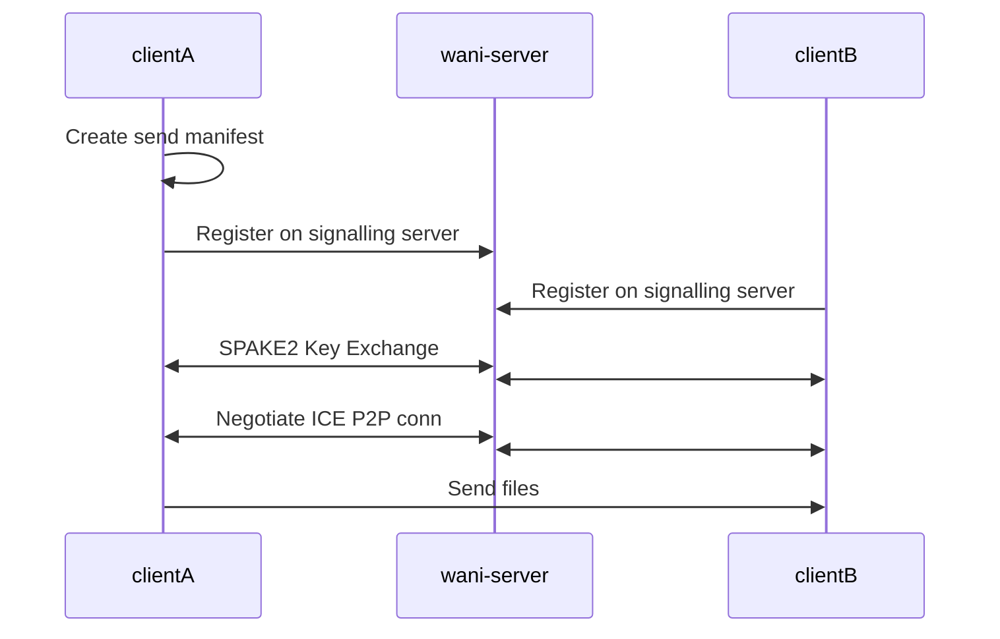

## Summary

Wani is a CLI tool for sending files. Wani uses the QUIC protocol over UDP to securely and reliably transfer files across the majority of networks. Wani supports resuming file transfers for corrupted files or after connection loss.

## Key Lessons

### AI-assisted research is powerful
While I have used AI agents to assist with coding in the past, this was the first time I did any extended research phase with AI. I was very pleasantly surprised by how well it functioned. It gave me much more confidence that what I wanted to do was feasible, helped me to understand what I needed to implement and why, and it provided me the basis to regularly share architecture with coding agents.

### Automated deployment rocks
This was the first time I tried using GitHub Actions and Linux daemons to automate rebuilding and redeploying my development server. Constantly having to copy over files and restart server binaries wastes both time and motivation, so I was excited to try this out and pleased with the results.

### Use packages for networking
As I conducted my research, there seemed to be an endless array of *possible* networking issues I could encounter, largely due to connection and firewall settings that I couldn't realistically anticipate. I was fascinated by the idea of implementing a homebrew stable UDP protocol, but in the interest of actually sending files by the end of the term, I opted for using pre-existing solutions.

### Don't trust AI for security
I realized partway through the project that I was getting inconsistent answers regarding process flow that was relevant to security concerns. The AI agent seemed generally conscious of security concerns, but even after providing detailed process flow details in prompts I still had to re-review any area of the code that seemed vulnerable to making mistakes.

## AI Assistance
I used AI extensively for this project in two phases.

The first phase was a "Research & Development" phase where I provided the concept of what I wanted to do and had the AI assemble agent-friendly documentation on the projects most similar to Wani (croc, wormhole, Thruflux). I proceeded with a collaborative architecture design session to make decisions on key implementation details, and then used the results of that work to create a simplified prompt that could be supplied to future planning agents, as well as a roadmap to finishing the "minimum viable prodcut" for Wani.

The second phase was implementation and testing. I prefer to create a planning file that I can review and re-use, then to hand off that planning file to an actual coding agent. Once the implementation reaches a testable checkpoint, then I test the new feature(s) manually and with the AI. Once I'm satisfied with the feature, I instruct the AI to record a summary of the changes it made - it is important to me that I can go back and review why specific details of the codebase were implemented the way they were. For larger features, I usually request a "tour" of the new code to make sure I know where all the important functions and infrastructure lives and how it all interacts, at least at a high level.

I usually have a preference for more hands-on implementation, but I wanted to try using Go for cross-compatability and exposure to the new language.

## Why is this project interesting to me?
Because it's something I want to use! Even in its MVP form, Wani mimics the functionality of a tool I use very often. Where I would use Croc, I can now use Wani, except that I have control over the networking infrastructure involved. Going forward, there are a lot of features focused around Wani-pond (self-hosted Wani server for asynchoronous file sharing) that would represent the totality of features that I have personally wanted. To borrow language from my friends in the business major, I'm addressing my own "pain point."

## Robust System Design
### Failover strategy
Currently N/A for MVP

In the short term, spinning up multiple VMs for signalling to clients would suffice for my needs.

### Scaling
The number one issue with scaling for Wani are network and processing demands on a TURN relay server. The actual data being sent over the signalling service is minimal and even my basic option could provide service to many users simultaneously, but I would have to carefully moderate access and usage of the TURN server. A few users regularly relying on the TURN server, or even one malicious user abusing access to it could exhaust the capacity available to me through my VM provider and run up a large bill.

### Performance
Provided I can reliably create P2P connections, the wani "system" should stay performant even with a large number of users. I do have some concerns about transfer speeds on very fast networks being gated by buffer sizes, but *my* internet is very slow, so I can't easily test it and any improvements wouldn't be noticeable for me.

### Authentication
Because identities are epehemeral on the signalling server, I don't need to worry too much about consistent and secure authentication. As long as the key exchange is actually private, user data should be secure. Wani-pond will have higher demands for long-term authentication, and I will probably switch to a private-public key model there.

### Concurrency
Currently, the main use of concurrency is in the signalling server for handling multiple client connections. I use goroutines per-connection instead of a pool for simplicity in the MVP, although I might want to investigate a more robust design in the future. Clients also use goroutines for ICE negotiation and connection management, mostly handled under-the-hood by the quic-go package.