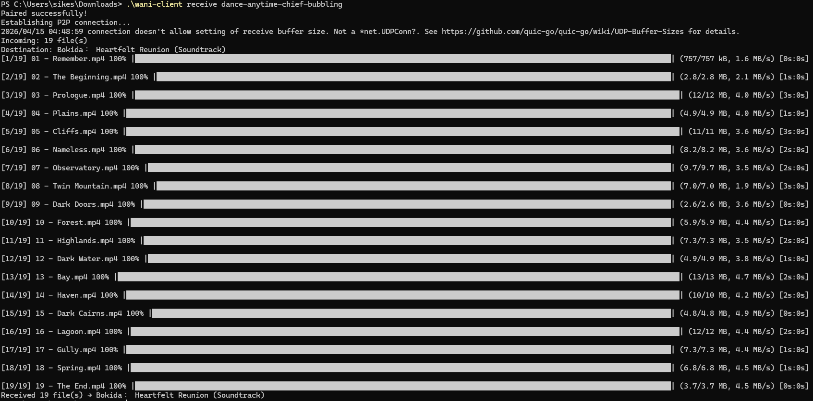
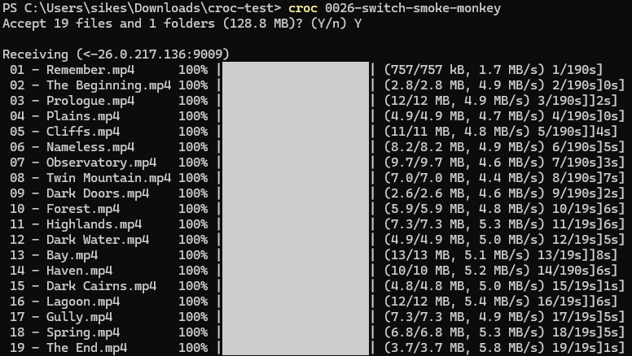

# Wani

Peer-to-peer file transfer. Direct connections via NAT hole punching, relay fallback when direct fails. Identity verified through human-readable pairing codes — no accounts, no cloud storage, no third party sees your files.

```
Sender:    wani-client send ./files
           → Pairing code: dance-anytime-chief-bubbling

Receiver:  wani-client receive dance-anytime-chief-bubbling
```

## Demo

| Wani (P2P, QUIC/UDP) | Croc (relay, TCP) |
|---|---|
|  |  |

Same 19 files (128.8 MB) transferred between the same two machines on different networks.

## How It Works

1. Sender connects to a signaling server, gets a 4-word pairing code
2. Receiver enters the code — both peers complete a [SPAKE2](https://datatracker.ietf.org/doc/rfc9382/) key exchange through the server
3. The server relays opaque blobs but **never learns the pairing code or the derived key**
4. [ICE](https://datatracker.ietf.org/doc/rfc8445/) negotiates the best path: direct UDP (NAT hole punching) → TURN relay → TCP relay
5. [QUIC](https://datatracker.ietf.org/doc/rfc9000/) connection established over the selected path — TLS 1.3 encrypted, multiplexed, reliable
6. Files stream directly between peers with per-file integrity checks (xxHash-64)

The signaling server brokers the connection. File data never touches it.

## Features

- **Direct P2P** — NAT hole punching via full ICE (STUN candidate gathering + connectivity checks). Works on most home networks without relay.
- **End-to-end encrypted** — SPAKE2 derives a shared secret from the pairing code. QUIC TLS 1.3 encrypts all data. The signaling server cannot decrypt anything.
- **Resumable transfers** — If the receiver disconnects, progress is saved. Reconnect with the same code and completed files are skipped.
- **Cross-platform** — Single static binaries for Linux and Windows. Pairing code auto-copied to clipboard on Windows/macOS.
- **Manifest-first** — Receiver sees the full file list before any data is sent. Directory structure is recreated automatically.
- **Integrity verified** — QUIC AEAD catches in-transit corruption. Per-file xxHash-64 catches disk/write errors end-to-end.

## Comparison

|  | Wani | [Croc](https://github.com/schollz/croc) | [Magic-Wormhole](https://github.com/magic-wormhole/magic-wormhole) | [Thruflux](https://github.com/nicholasgasior/thruflux) |
|---|---|---|---|---|
| **Transport** | QUIC/UDP (P2P) | TCP (relay) | TCP (direct + relay race) | QUIC/UDP (P2P) |
| **NAT traversal** | Full ICE (STUN + TURN) | Relay only (no hole punching) | Direct TCP attempt + relay fallback | Full ICE (STUN + TURN) |
| **Key exchange** | SPAKE2 (RFC 9382) | Custom PAKE (SIEC curve) | SPAKE2 | None (join code is session ID, not crypto input) |
| **Encryption** | QUIC TLS 1.3 + SPAKE2 identity proof | PAKE-derived key, custom protocol | NaCl SecretBox (XChaCha20-Poly1305) | QUIC TLS 1.3 (no identity verification) |
| **Code entropy** | 44 bits (4 words × 11 bits) | Variable (~42+ bits) | ~16 bits (2 words) | ~95 bits (16 alphanumeric) |
| **Multi-file** | Sequential streams, per-file progress | Sequential, per-file | Single archive | Parallel streams |
| **Resume** | Per-file (automatic on reconnect) | No | No | No |
| **Identity verification** | HMAC proof over SPAKE2 key in QUIC | PAKE confirmation | SPAKE2 key confirmation | None |
| **Language** | Go | Go | Python (+ Rust, Go ports) | C++17 |

**What's distinct about Wani:**
- Combines QUIC transport (like Thruflux) with SPAKE2 identity verification (like Wormhole) — direct P2P with cryptographic proof that both peers know the code
- Resumable transfers that survive receiver disconnects — sender waits and resumes automatically
- Relay-first tools (Croc) always route through a server; Wani tries direct first
- Wormhole's default 16-bit codes are vulnerable to online guessing; Wani's 44-bit codes provide a larger margin
- Thruflux has no cryptographic identity verification — join codes are session identifiers, not PAKE inputs

## Architecture

```
cmd/wani-server/        Server binary (signaling + STUN + optional TURN)
cmd/wani-client/        Client binary (CLI frontend)
internal/server/        WebSocket signaling, session management
internal/client/        Core transfer library (zero terminal I/O)
internal/protocol/      Shared types: messages, manifest, pairing codes
internal/identity/      SPAKE2 ephemeral identity
```

See [architecture.md](architecture.md) for design decisions and [research/WaniProcessFlow.md](research/WaniProcessFlow.md) for the full transfer sequence.

## Usage

```bash
# Send a file or directory
wani-client send ./photos

# Receive (destination defaults to current directory)
wani-client receive blue-hammer-ocean-tiger

# Receive to a specific directory
wani-client receive -out ~/Downloads blue-hammer-ocean-tiger

# Check your public IP (STUN query)
wani-client stun

# Use a different signaling server
wani-client -server ws://myserver:8080/ws send ./file.txt
```

## Building

Requires Go 1.21+.

```bash
./build.sh
# Produces: build/wani-server, build/wani-client, build/wani-client.exe
```

Server IP is read from `config.json` and baked into the client binary at build time. Override at runtime with `-server`.

## Status

Phases 0–3 complete (signaling, SPAKE2, ICE, QUIC, file transfer with resume). Phase 4 (TURN relay fallback) is next. See [ROADMAP.md](ROADMAP.md) for details.